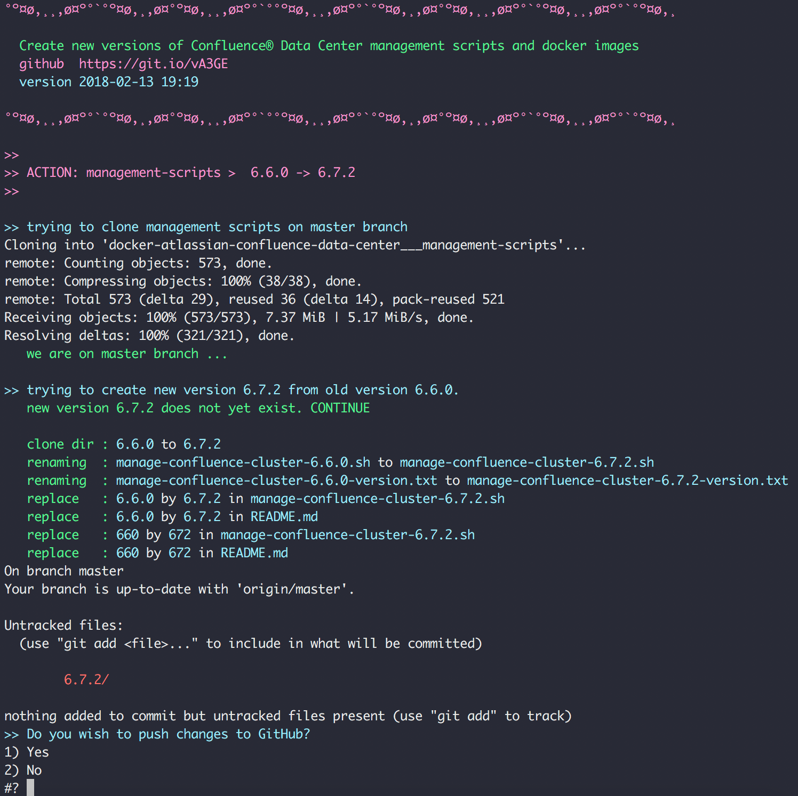

# How to create new version for new Confluence Version


### (0) Install provision script

```
cp provision-confluence-ds-versions.sh /usr/local/bin/
chmod +x /usr/local/bin/

mkdir ~/.provision-confluence-ds-versions-workdir/
```

Note that:

 * script will need you to be authenticated for all GitHub Repos cloned.
 * docker needs to be installed
 * script will clone git repos to `~/.provision-confluence-ds-versions-workdir/`


&nbsp;

### (1) Create new Confluence base Image

For every new DataCenter version we first need a new base image in [codeclou/docker-atlassian-base-images](https://github.com/codeclou/docker-atlassian-base-images) repo.

```
                                     # WHAT              # OLD   # NEW
provision-confluence-ds-versions.sh  base-image          6.6.0   6.7.1
```

What the script will do:

 * (1) clone the repo
 * (2) branch off of oldVersion to newVersion branch
 * (3) replace version strings in files
 * (4) builds docker image locally (for testing only)
 * (5) asks if you want to push changes to remote

What you will need to do:

 * (1) check docker hub to see if [build for branch succeeds](https://hub.docker.com/r/codeclou/docker-atlassian-base-images/builds/)


&nbsp;

### (2) Create new management scripts

```
                                     # WHAT              # OLD   # NEW
provision-confluence-ds-versions.sh  management-scripts  6.6.0   6.7.1
```

What the script will do:

 * (1) clone the repo
 * (2) copy version folder containing script to new version folder
 * (3) replace version strings in files
 * (4) asks if you want to push to remote

What you will need to do:

 * (1) Check repo if scripts have been created correctly

Script Preview:




&nbsp;

### (3) Create confluencenode-{VRSN} branch and docker image

```
                                     # WHAT              # OLD   # NEW
provision-confluence-ds-versions.sh  confluencenode      6.6.0   6.7.1
```

What the script will do:

 * (1) clone the repo
 * (2) checkout branch confluencenode-{lastVersion}
 * (3) branch off confluencenode-{newVersion}
 * (4) replace version strings in files
 * (5) builds docker image locally (for testing only)
 * (6) asks if you want to push to remote

What you will need to do:

 * (1) check docker hub to see if [build for branch succeeds](https://hub.docker.com/r/codeclou/docker-atlassian-confluence-data-center/builds/)


 &nbsp;

 ### (4) Create loadbalancer-{VRSN} branch and docker image

 ```
                                      # WHAT              # OLD   # NEW
 provision-confluence-ds-versions.sh  loadbalancer        6.6.0   6.7.1
 ```

 What the script will do:

  * (1) clone the repo
  * (2) checkout branch loadbalancer-{lastVersion}
  * (3) branch off loadbalancer-{newVersion}
  * (4) replace version strings in files
  * (5) builds docker image locally (for testing only)
  * (6) asks if you want to push to remote

 What you will need to do:

  * (1) check docker hub to see if [build for branch succeeds](https://hub.docker.com/r/codeclou/docker-atlassian-confluence-data-center/builds/)
